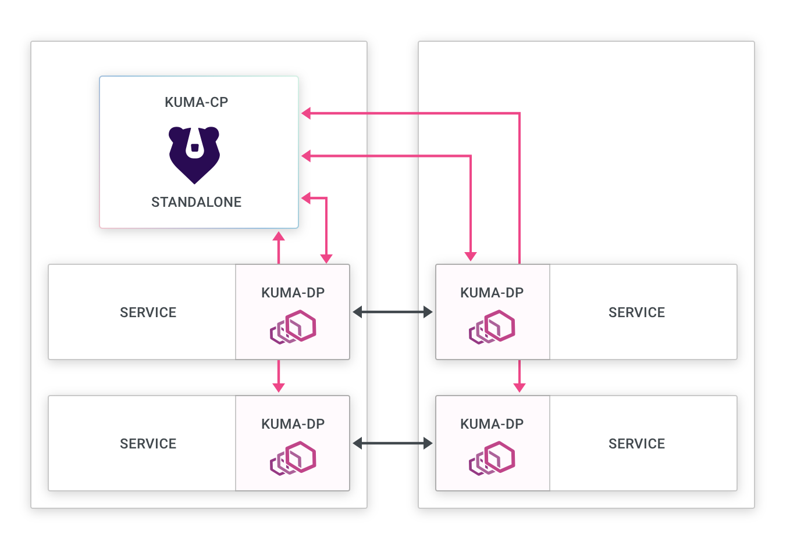

Installing Kong Mesh with Konnect ingress
===========================================================

This example assumes installition on an existing k8s cluster, then installs Kong Mesh Enterprise on that cluster in Standalone mode.  It also provides instructions for installing Konnect dataplanes



## Prerequisites
1. AKS Credentials (App ID and Password)
2. Terraform CLI
3. Azure CLI
4. AKS Domain name
5. Kong Mesh Enterprise license
6. Konnect login
7. Konnect Personal Access Token (pat)

## Procedure

### Optional AKS install

If you don't already have a k8s cluster stood up, please follow the below instructions to install a vanilla instance of AKS:

1. Open `/tf-provision-aks/aks-cluster.tf` to search & replace `simongreen` with your own name.  That way, all AKS objects will be tagged with your name making them easily searchable. Also, update the Azure region in this file to the region of your choice.

2. If you haven't done so already, create an Active Directory service principal account via the CLI:

 ```bash
 az login
 az ad sp create-for-rbac --skip-assignment.  # This will give you the `appId` and `password` that Terraform requires to provision AKS.
 ```

3.  In `/tf-provision-aks` directory, create a file called `terraform.tfvars`.  Enter the following text, using your credentials from the previous command:

```bash
appId    = "******"
password = "******"
location = "East US"
```

4. Via the CLI, `cd tf-provision-aks/` then run the following Terraform commands to provisions AKS:

```bash
terraform init
terraform apply
```

5. Once terraform has stoodup AKS, setup `kubectl` to point to your new AKS instance:

```bash
az aks get-credentials --resource-group $(terraform output -raw resource_group_name) --name $(terraform output -raw kubernetes_cluster_name)
kubectl get all
```

## Mesh Install Procedure

1. Insert your Enterprise license under `./license/license.json` of this directory.

2. Using `helm`, run the following command:

```bash
helm repo add kong-mesh https://kong.github.io/kong-mesh-charts
```

3. Using kubectl, run the following command:

```bash
 kubectl create namespace kong-mesh-system
```

4. Create the license secret:

```bash
 kubectl create secret generic kong-mesh-license -n kong-mesh-system --from-file=license/license.json
```

4. Install Kong Mesh:

```bash
helm repo update
helm upgrade -i -n kong-mesh-system kong-mesh kong-mesh/kong-mesh \
   --set 'kuma.controlPlane.secrets[0].Env="KMESH_LICENSE_INLINE"' \
   --set 'kuma.controlPlane.secrets[0].Secret="kong-mesh-license"' \
   --set 'kuma.controlPlane.secrets[0].Key="license.json"'
   ```

## Konnect Ingress Install Procedure

1. From the Konnect runtime instance page, copy the contents of the certificate and key to konnect/tls.crt and konnect/tls.key respectively.

2.  Create the namespace and secrets

```bash
kubectl create namespace kong
helm repo add kong https://charts.konghq.com
helm repo update
kubectl create secret tls kong-cluster-cert -n kong --cert=konnect/tls.crt --key=konnect/tls.key
```

3. Copy the configuration parameters from Konnect to konnect/values.yaml.

4.  Install (or upgrade) kong using the new configuration:

```bash
helm upgrade --install kong kong/kong -n kong --values konnect/values.yaml
```

5. Via the Konnect runtime instances page, ensure the new dataplane (runtime instance) has connected.

6. Via the CLI, figure out what the external IP is of the Konnect dataplane:

```bash
kubectl get services --all-namespaces -o json | jq -r '.items[] | { name: .metadata.name, ns: .metadata.namespace, ip: .status.loadBalancer?|.ingress[]?|.ip  }'
```

7. Update konnect/konnect-ingress.yaml file with the external IP, by using search+replace on `999.999.999.999`.  Save the file.

8. Copy your Konnect personal access token (pat) to a file call `pat`

9.  Run `deck sync --konnect-runtime-group-name default --konnect-token-file pat --state=konnect/konnect-ingress.yaml` to create the Services and Routes.


10.  Via the Browser, copy the external address.  This will form your GUI URL: `http://mesh-gui.app.<external address>.nip.io/gui`

11.  Click through the wizard, choosing the Standalone deployment.  Next choose Kubernetes.  Then choose the Demo App.

12.  As per the instructions, copy the `kubectl` command and create the DemoApp in your cluster.

13. Via a new browser tab, copy the external address.  This will form your GUI URL: `http://demo-app.app.<external address>.nip.io`

## Enable mTLS

1. Enable mTLS using the following command:

```bash
kubectl apply -f konnect/mtls.yaml
```

## Create a Gateway ingress using Konnect dataplane

1. Via the Mesh GUI, navigate to Data Plane Proxies and click the #Create data plane proxy# button.

2. Select default mesh, then click #Next#

3. In the namespace field, type `kong` which is where the Konnect dataplane ingress point is running.

4. Copy and paste the CRD that is generated and execute it via the CLI.

5. Give it a couple of minutes, as the pods need to restart.  After a short wait, you should now see 3 DP proxies on the dashboard, including the kong proxy apearing as `gateway_delegated`.

6. To test, navigate to http://demo-app.app.<external address>.nip.io/ and you should be able to see the `Kuma Counter Demo 1.0` app.
